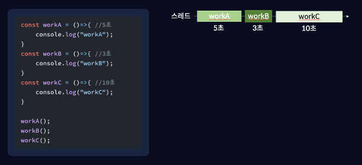
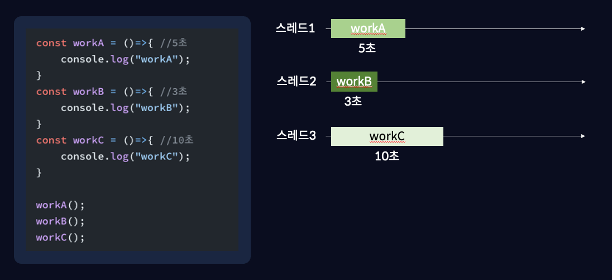
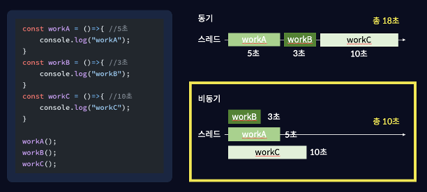

안녕하세요🤗

> 이번시간에는 자바스크립트의 비동기 처리에 대한 내용과 함께 동기, 비동기 란 무엇인지, 그리고 작업을 비동기로 처리하려면 어떻게 해야하는지에 대한 내용을 배워보도록 하겠습니다.

# 동기와 비동기

## 동기

동기란 하나의 작업이 실행되는 동안은 다른 작업을 동시에 수행하지 않는 방식으로, 

다시 말해 하나의 작업이 종료될 때 까지 다른 작업을 실행하지 못하고, 앞선 작업이 끝나야 다음 작업을 할 수 있는 순차적인 방식을 말합니다. 

지금까지 우리가 예시로 들었던 모든 코드들은 동기적으로 작동했습니다.

```js
console.log("a");
console.log("b");
console.log("c");
```

다음과 같이 작성된 코드는 작성된 순서대로 실행되기 때문에 실행결과 a, b, c가 출력되고, 순서대로 출력되는 이유가 바로 자바스크립트 코드가 동기적으로 처리 되었기 때문입니다.

더 자세한 설명을 위해 다음과 같은 코드가 있다고 가정해봅시다.

```js
const workA = ()=>{ //5초
    console.log("workA");
}
const workB = ()=>{ //3초
    console.log("workB");
}
const workC = ()=>{ //10초
    console.log("workC");
}

workA(); 
workB(); 
workC(); 
```

이 workA, workB, workC 3가지 함수가 실행 후 종료되기 까지 걸리는 시간이 각각 5초, 3초, 10초 라고 가정해보겠습니다.

### 스레드와 멀티스레드

 

프로그램에서 이러한 작업들을 처리하는 주체를 "스레드" 라고 부르는데, 왼쪽의 작업들을 동기적으로 처리한다면, 스레드는 workA를 5초 동안 처리하고, 이후 workB를 3초 동안 처리한 다음, 앞의 두 개의 작업을 모두 처리한 후 workC를 10초 동안 처리하게 됩니다.

따라서 동기적으로 해당 작업을 처리하게 되면, 순서대로 모든 작업들을 하나씩 처리하기 때문에, 처리 될 때 까지 걸리는 시간은 총 18초가 되고, 

이렇게 하나의 스레드에서 여러 작업을 동시에 처리하지 못하고, 하나의 작업이 종료된 이후에 다른 작업을 처리할 수 있는 방식을 "블로킹 방식" 이라고 부르기도 합니다.

기본적으로 자바스크립트는 작업을 동기적으로 처리하지만, 실제로 자바스크립트의 모든 작업들을 동기적으로 처리하게 된다면 많은 문제가 발생하게 됩니다.

만약 웹 사이트에서 모든 작업을 동기적으로 처리해, 웹 사이트 내부의 모든 이미지들을 불러 올 때 까지 버튼 클릭이나 키보드의 입력과 같은 간단한 기능들을 아무것도 사용하지 못한다면, 우리는 웹 사이트에서 오류가 발생했다 라고 인식할 것 입니다.

이처럼 오래 걸리는 작업을 먼저 수행해야 할 경우에는, 동기적으로 작업을 수행하게 되면, 작업 시간이 매우 길어지기 때문에 성능상의 문제가 생기게 됩니다.

 

그럼, 스레드를 여러 개 만들어서, 각각의 스레드마다 작업을 할당한 다음, 여러 작업들을 동시에 처리 할 수 있게 하면 안되는 건가? 하는 의문이 생길 수 있습니다.

이렇게 하나의 스레드가 아닌, 여러 스레드에서 작업을 동시에 수행하게 하는 방식을 "멀티 스레드" 의 방식이라고 합니다.

하지만, 자바스크립트는 "싱글 스레드" 방식, 즉 하나의 스레드만으로 동작하기 때문에, 이러한 멀티 스레드 방식으로는 작동할 수 없습니다.

따라서 우리는 이 동기적 처리의 문제점을 해결하기 위해, 하나의 스레드에서 여러 작업들을 동시에 처리하는 비동기 처리로 작업을 수행할 수 있습니다.

## 비동기

비동기 처리는 동기적 처리와는 반대로, 어떠한 작업이 종료되길 기다리지 않고, 그 다음 작업도 동시에 진행하는 방식을 뜻합니다.

 

이 workA, workB, workC 작업들을 동기적으로 처리 했을 때와는 다르게 비동기적으로 처리한다면, 이렇게 하나의 스레드에서 세 개의 작업을 동시에 처리할 수 있기 때문에, 작업을 처리하는 시간이 18초에서 10초로 훨씬 줄어들게 됩니다.

이렇게 여러 작업들을 비동기적으로 처리하면 작업들을 훨씬 빠르게 처리할 수 있고, 동기적 처리의 문제점들을 해결할 수 있습니다.

그리고 이처럼 하나의 스레드에서 여러 개의 작업을 동시에 처리하는 방식을 "논 블로킹 방식" 이라고 부를 수 있습니다.

# 자바스크립트의 비동기 처리

그렇다면, 자바스크립트 코드를 비동기적으로 처리하려면 어떻게 작성해야할까요?

자바스크립트에서는 가장 쉽게 비동기 처리를 연습해 볼 수 있는 대표적인 내장함수가 있습니다.

바로 setTimeout 이라는 내장함수 인데요, 한 번 사용해보겠습니다.

setTimeout 내장 함수에는 콜백함수와 delay time 이라는 두 개의 매개변수가 들어갑니다.

이 delay time은 ms 단위 이기 때문에 지연 시간으로 1초를 원한다면 1000을, 5초를 원한다면 5000을 작성해주면 됩니다.

우리는 3초를 작성해주도록 하겠습니다.

```js
setTimeout(() => {
    console.log("3초만 기다리세요");
}, 3000);
```

코드 실행 결과 3초가 지난 후에 "3초만 기다리세요" 문장이 콘솔창에 출력되는 것을 확인할 수 있습니다.

이 setTimeout 함수는 이렇게 매개변수로 입력받은 시간만큼 기다렸다가, 매개변수로 입력받은 콜백함수를 실행시키는 함수입니다.

그럼, 이번에는 setTimeout 함수를 호출하고, 바로 아래 다른 문장을 출력하는 코드를 작성해보겠습니다.

```js
setTimeout(() => {
    console.log("3초만 기다리세요");
}, 3000);

console.log("종료");
```

코드를 실행해보면, 먼저 호출한 setTimeout 함수의 console보다 맨 아래 작성한 console이 먼저 출력된것을 볼 수 있는데요,

그 이유는 바로 setTimeout 함수에 있는 콜백함수가 실행 종료 될 때 까지, 즉 3초를 기다리지 않고 바로 아래의 console.log()가 실행되었기 때문입니다.

이 종료 라는 문장을 정말 이 코드가 종료됐을 때 출력하고싶다면, 우리는 콜백함수를 이용해 해당 코드를 인수로 넘겨주어야합니다.

console.log("종료") 명령을 콜백함수로 work라는 비동기 함수에 넘겨주도록 하겠습니다.

```js
const work = (callback) => {
  setTimeout(() => {
    console.log("3초만 기다리세요");
    callback();
  }, 3000);
};

work(() => {
  console.log("종료");
});

```

코드를 실행해보면, 이번엔 3초만 기다리세요 라는 문장 이후에 종료 라는 문자열이 출력되는 것을 확인할 수 있습니다.

그럼, 이번에는 우리가 작성했었던 workA, workB, workC 함수를 비동기적으로 처리해보도록 하겠습니다.

workA는 5초, workB는 3초, workC는 10초의 지연시간을 넣어주고, 가장 아래에는 workD라는 일반 함수를 생성해보겠습니다.

```js
const workA = () => {
  setTimeout(() => {
    console.log("workA");
  }, 5000);
};
const workB = () => {
  setTimeout(() => {
    console.log("workB");
  }, 3000);
};
const workC = () => {
  setTimeout(() => {
    console.log("workC");
  }, 10000);
};
const workD = ()=>{
    console.log("workD");
}

workA();
workB();
workC();
workD();
```

코드를 실행해보면, 동기적으로 처리된 workD가 가장 먼저 출력되고, 3초 후에는 workB가, 2초 후에는 workA가, 마지막으로 5초 후에는 workC가 출력되는 것을 확인 할 수 있습니다.

이렇게 이전 작업이 끝날 때 까지 기다리지 않고, 다음 작업이 동시에 진행되는 방식을 `비동기 처리`라고 하고, 우리는 setTimeout 함수를 이용해 특정 작업들을 비동기적으로 처리를 할 수 있습니다.

이번 시간에는 동기, 비동기 처리에 대한 개념과 자바스크립트에서 특정 작업을 비동기적으로 처리 하는 방법에 대해 배워보았습니다.

다음 시간에는 자바스크립트에서 비동기 처리를 목적으로 제공되는 내장 객체인, promise 객체에 대해 배워보도록 하겠습니다.

감사합니다.
