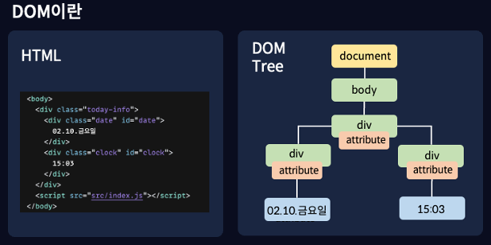
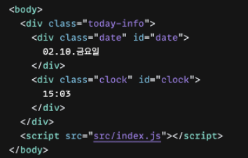

안녕하세요😄

> 이번 시간에는 DOM API란 무엇인지 자세하게 알아보고, 자주 사용되는 여러 DOM API들을 몇 가지 배워보도록 하겠습니다.

# DOM API란

DOM이란 HTML로 작성된 여러 요소들에 자바스크립트가 접근할 수 있도록 브라우저가 변환시킨 객체이고, 자바스크립트는 이러한 DOM을 통해 HTML로 짜여진 요소들을 생성하고 수정하고 삭제할 수 있다고 배웠습니다.

또한 DOM은 자바스크립트가 자신에게 접근해, DOM을 조작하고 수정할 수 있는 방법인 DOM API를 제공하기 때문에 자바스크립트는 이를 활용해 웹 요소들을 생성하고 수정하고 삭제할 수 있다고 배웠습니다.

DOM API를 이용해 HTML 요소들에 접근하기 위해서는 이전 시간에 배웠던 DOM Tree를 참고해야하는데요, 이 DOM Tree를 자세하게 살펴보도록 하겠습니다.

 

오른쪽의 트리는 왼쪽의 HTML 코드를 DOM Tree로 나타낸 것입니다.

이 DOM Tree는 크게 노랑색으로 표시되어있는 document 문서노드, 초록색으로 표시되어있는 요소노드, 분홍색으로 표시되어있는 어트리뷰트 노드, 마지막으로 파랑색으로 표시되어있는 텍스트 노드로 나타낼 수 있습니다.

우리는 DOM API를 이용해 요소에 접근하기 위해, 해당 요소들을 찾을 때 문서, 요소, 어트리뷰트, 텍스트 순서로 각각의 노드에 접근해야하고, 이 문서 노드는 트리의 가장 위쪽에 위치하기 때문에 어떤 요소에 접근하든지 항상 이 문서 노드를 거쳐서 다른 요소들에 접근해야합니다.

자바스크립트가 이 DOM API를 사용해 웹 페이지를 조작하기 위해서는 먼저, 조작하고자하는 요소를 찾아 해당 요소를 선택한 다음, 선택된 요소를 조작해야 합니다.

그럼, 제일 먼저 특정 요소를 찾고 선택하는 DOM API에 대해 배워보겠습니다.

## 요소 찾고 선택하기

먼저 코드샌드박스에서, index.html에 들어가 body 태그 안에 다음과 동일한 코드를 작성해주겠습니다.

 

### document.getElementById(id)

특정 요소를 찾을 때에는, 가장 먼저 문서노드 document에 접근해야하기 때문에, document를 작성해줍니다.

우리가 가장 먼저 배워볼 API는 getElementById() 입니다.

getElementById는 말 그대로 특정 요소를 id값으로 요소를 가져온다 라는 의미이고, 실제로 특정 요소 객체를 반환합니다.

```js
console.log(document.getElementById("date"));
```

HTML 요소들 중, date라는 id를 갖고있는 요소를 찾은 다음 출력해보겠습니다.

실제로 출력결과, 우리가 index.html 파일에서 작성했던 요소들 중, id 값이 date인 요소가 반환된 것을 볼 수 있습니다.

이 getElementById는 만약 동일한 id를 갖고있는 요소가 여러개 있을 경우, 가장 위에 있는 첫 번째 요소만 반환하는 API 입니다.

### document.querySelector(cssSelector)

이렇게 getElementById 처럼 단 하나의 요소를 반환하는 또 다른 API 가 있습니다.

이번에는 querySelector에 대해 알아보겠습니다.

querySelector는 요소의 id값이 아닌, css 선택자로 요소 노드를 반환하는 API 입니다.

우리는 div라는 태그로 감싸져있는 요소들 중, class 이름이 date인 요소를 반환해보겠습니다.

```js
console.log(document.querySelector("div.date"));
```

코드를 실행해보면, 동일하게 class 이름이 date인 요소가 출력되는 것을 볼 수 있습니다.

그럼 이번에는 하나의 요소만 반환하는 것이 아닌, 여러 요소들을 반환하는 API를 사용해보겠습니다.

### document.querySelectorAll()

먼저 index.html로 이동해서, class 이름이 clock인 요소의 class 이름을 date로 변경해준 다음,

```js
  <div class="today-info">
      <div class="date" id="date">
        02.10.금요일
      </div>
      <div class="date" id="clock">
        15:03
      </div>
    </div>
```

이번엔 querySelector가 아닌, querySelectorAll을 사용해 코드를 실행해보겠습니다.

```js
console.log(document.querySelectorAll("div.date"));
```

동일하게 div 태그로 감싸져 있고, class 이름이 date인 요소를 찾아 출력해보면, 이번엔 2개의 요소가 출력되는 것을 볼 수 있습니다.

### document.getElementsByClassName(class)

이번엔 동일한 class 이름을 갖고있는 모든 요소들을 출력하는 getElementsByClassName을 사용해보겠습니다.

getElementsByClassName을 통해 class이름이 date인 요소를 찾으면, 

```js
console.log(document.getElementsByClassName("date"));
```

0번째 요소와 1번째 요소에 두 개의 값이 출력되는 것을 볼 수 있습니다.

### document.getElementsByTagName

이번에는 tag의 이름으로 여러 요소들을 한 번에 찾아보겠습니다.

getElementsByTagName을 사용하면, 특정 tag의 이름을 갖는 모든 요소들을 가져올 수 있습니다.

div라는 tag를 사용한 모든 요소들을 출력하는 코드를 작성해보겠습니다.

```js
console.log(document.getElementsByTagName("div"));
```

출력해보면, div 태그를 사용한 모든 요소들이 이렇게 3개가 모두 출력되는 것을 볼 수 있습니다.

## 요소 조작하기

이번에는 어트리뷰트 노드에 접근하고, 값을 조작해보겠습니다.

지금까지 배운 것을 사용해 먼저 요소 노드에 접근한 다음, 해당 요소들의 속성들을 조작해보겠습니다.

### className

먼저, getElementById를 사용해 id 값이 date인 요소들을 가져온 다음, 이 요소의 class 이름을 출력해보도록 하겠습니다.

```js
console.log(document.getElementById("date").className);
```

코드를 실행하면 실제 class 이름인 date가 나오게 됩니다.

그 다음, 이번엔 이 요소의 class 이름을 한 번 변경해보겠습니다.

id 값이 date인 요소를 변수에 따로 저장한 다음, 해당 요소의 class 이름을 change로 수정해보겠습니다.

```js
const dateElement = document.getElementById("date");
dateElement.className = "change";
```

특정 요소의 class 이름을 변경할 때에는 이렇게 변수의 값을 바꾸는 것과 동일하게 바꿀 이름을 할당해주면 됩니다.

실제로 dateElement를 출력해보면, class 이름이 방금 변경한 change로 변경된 것을 볼 수 있습니다.

### id 

이번에는 class 이름이 date인 요소를 찾고, 해당 요소의 id 값을 출력해보겠습니다.

class 이름이 date인 요소를 하나만 찾기 위해서는 querySelector를 사용해야합니다.

```js
console.log(document.querySelector("div.date").id);
```

이번에도, 이 요소의 id 값을 change로 변경 후, 해당 요소를 출력해보겠습니다.

```js
const dateElement = document.querySelector("div.date");
dateElement.id = "change"

console.log(dateElement);
```

코드 실행 결과, id 값이 change로 변경되어 잘 출력되는 것을 확인할 수 있습니다.

### classList

이번에는 className과 비슷하게 요소의 class 값에 접근 가능한 classList를 사용해보겠습니다.

동일하게 id 값이 date인 요소를 찾고, classList를 사용해 해당 요소의 class에 접근해보겠습니다.

```js
console.log(document.getElementById("date").classList);
```

코드를 실행해보면, className을 사용했을 때와는 다른 결괏값이 나오는 것을 볼 수 있습니다.

classList는 className처럼 특정 요소의 class 속성에 접근하지만, class와는 다르게 여러가지 메서드들을 사용할 수 있습니다.

이 classList는 add, remove, item, toggle, contains, replace와 같은 메서드를 제공합니다.

이 메서드 중에 가장 많이 사용되는 add와 remove 메서드를 사용해보겠습니다. 

먼저 add를 사용해 class 이름을 change로 변경해보겠습니다.

```js
const dateElement = document.getElementById("date");
dateElement.classList.add("change")
console.log(dateElement);
```

코드를 실행하면, 해당 요소의 class 이름이 change로 변한 것이 아니라, 기존 이름인 date 에 change 가 추가된 것을 볼 수 있습니다.

className은 요소에 무언가를 대입하면 class 이름 전체가 변경되지만, classList는 이렇게 기존의 값에 특정 값을 추가하거나 제거하고 변경 가능한 속성입니다.

그럼, 이번엔 이 date 라는 class 이름을 remove 메서드를 통해 지워보도록 하겠습니다.

```js
const dateElement = document.getElementById("date");
dateElement.classList.add("change");
dateElement.classList.remove("date");
console.log(dateElement);
```

코드를 실행하면, 실제 해당 요소의 class 이름에서 date가 삭제되어 change만 남아있는 것을 볼 수 있습니다.

classList를 사용하면, 이렇게 다양한 메서드를 통해 편리하게 class 속성들을 조작할 수 있습니다.

어트리뷰트 노드들을 선택하고 조작해보았으니, 이번에는 텍스트 노드들의 값을 변경해보겠습니다.

### textContent

index.html에 작성된 코드로 이동해, 다시 id가 clock인 요소의 class를 clock으로 변경해주겠습니다.

```js
  <div class="today-info">
      <div class="date" id="date">
        02.10.금요일
      </div>
      <div class="clock" id="clock">
        15:03
      </div>
    </div>
```

그 다음, index.js로 돌아와서, 이 "15:03" 이라는 텍스트를 변경해보도록 하겠습니다.

텍스트는 textContent를 통해 요소에 새로운 텍스를 할당할 수 있습니다.

먼저 id값이 clock인 요소를 선택해준 다음, textContent를 사용해 텍스트를 "12:00"로 변경해보겠습니다.

```js
const clockElement = document.getElementById("clock");
clockElement.textContent = "12:00";
```

오른쪽에 브라우저 탭을 눌러보면, 텍스트가 12:00으로 변경된 것을 확인할 수 있습니다.

마찬가지로 class 이름이 date인 요소를 선택해 "02.10.금요일" 의 값을 "03.29.수요일"로 변경해보겠습니다.

```js
const dateElement = document.querySelector("div.date");
dateElement.textContent = "03.29.수요일";
```

이렇게 DOM API를 사용해, document 노드를 통해 요소 노드, 어트리뷰트 노드 그리고 텍스트 노드에 접근하고 값을 수정하는 방법을 알아보았습니다.

다음 시간에는 이번 시간에 배운 내용을 활용해, 자바스크립트로 직접 DOM을 조작해 새로운 요소들을 추가하는 방법과, 생성한 요소에 스타일을 생성하고 수정하는 방법에 대해 배우고, 요소에 이벤트를 설정하는 방법까지 알아보도록 하겠습니다.

감사합니다.